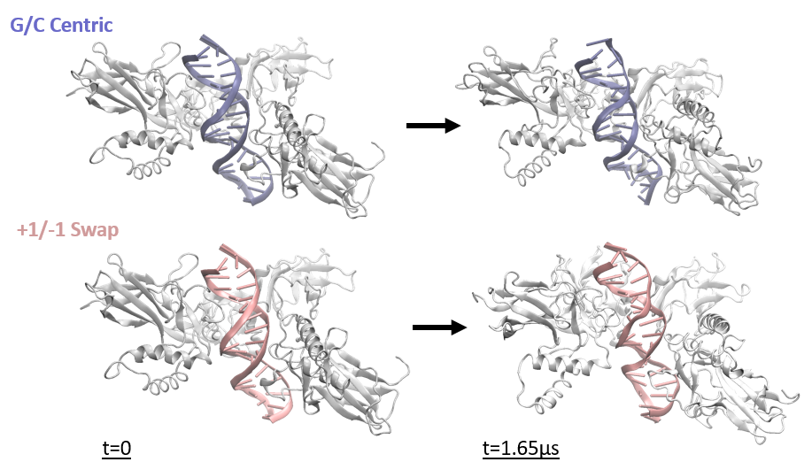
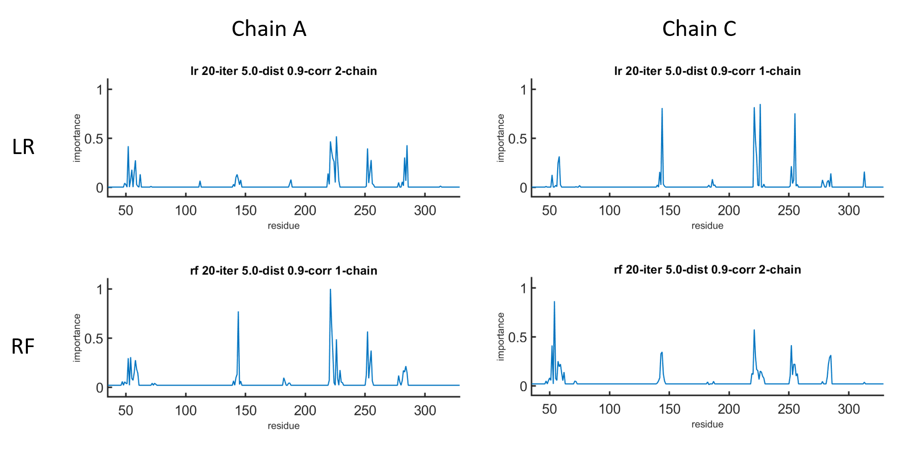

# Machine Learning Importance-Residue Profile Analysis on MD simulation of NF-κB p52 homodimer-DNA complexes

## I |  Overview

### Molecular Dynamics 
12 $\mu s$ Trajectories of PSel-κB p52 Homodimer-DNA Complex Simulations 
   - Natural G/C centric DNA
   - -1/+1 swap DNA (1 base pair change)
 
 Simulation Software: `GROMACS`   
 Visualization Software: `Visual Molecular Dynamics (VMD)`


***

### Machine Learning 

 Machine Learning Model 
 - ***Logistic Regression*** (LR)
 - ***Random Forest*** (RF)

 Hyperparameter Tuning
 - Correlation Cutoff $\rho$
 - Distance Cutoff $d$
 - Iteration Cutoff $n$
 - Partition Ratio $p$

 Language: `Matlab`  
> Program:  
> Grasping the **dynamical importance profile** of all residues in p52 homodimer  to differentiate two different complex reaction, in turn obtaining **important residues of p52 homodimer** and its **dynamical behavior** under hyperparameter tuning to the reaction when there is a subtle change in DNA  
 
 

***

### Importance Profile Mapping to Structure 

 Language: `VMD Tk Console`  
> Program: 
> Importing importance profile which maps with `resID` (residue id), then map the importance as gradient of color 

***

### Dynamics of Important Profile 

 Language: `Python` - `Matplotlib` & `Numpy`   
> Program:   
> Plotting selected important residue (manually picked from observing importance profile) then plotting its trend of varying hyperparameter.   
>
> The results are categorized into
> - increasing
> - decreasing
> - generally unchanged

## II |  Code Recipe

1. Download the `VMD tutorial` from VMD official page and do it to familiar the coding of VMD. Use `VMD` to view the trajectories. A premade session to view the trajectory could be loaded as:
	``` bash
	vmd -e view.vmd
	```
	


2. Use `GROMACS` to measure the minimum distance between each residue of p52 dimer and each nucleobase of the central DNA (Position -5 to +5). This `index.ndx` is needed for telling `GROMACS` which part to calculate. The measurement could be done as:
	``` bash
	gmx pairdist -f traj.xtc -s structure.pdb -n index.ndx -o mindisres.xvg -refgrouping res -selgrouping res
	```
	Choose Protein as the reference and Central_DNA as the selection when prompt   
	> Protein:  
    > index order (295 residues in each chain of p52 dimer)  
    > **chain A [chain I]**: residue 35 to 329  
    > **chain C [chain II]**: residue 35 to 329
    >
    > DNA:  
    > 11 nucleobases in each strand of central DNA   
    > **chain B[strand 3']**: position order +5 to -5  
    > **chain D[strand 5']**: position order -5 to +5   
    
    `mindisres.xvg` with $295*2*11*2$ columns is obtained.   
    The columns contain distance like this: `pro1-dna1`, `pro2-dna1`, ..., `pro1-dna2`, `pro2-dna2`, ...

3. Use `mindisres.xvg` as the training set and train your own linear logistic regression and random forest model in [`ml.m`](https://github.com/marcowongtc/FYP/tree/main/1st_Term/machine_learning).  
    > Graph and csv of importance profile with naming `()_-model_()-iter_()-dist_()-corr` file would be produced under given hyperparameter set with [model, $n$, $d$, $\rho$]. 

    

4. Use [`csv_converter.py`](https://github.com/marcowongtc/FYP/tree/main/1st_Term/plotting/csv_converter) to split the original importance profile csv into two chain of protein for plotting.   
(Updated plotting.py does not require this step!) 
    > ()_-model_()-iter_()-dist_()-corr.csv  
    > -> ()_-model_()-iter_()-dist_()-corr-()chain.csv  
    > -> ()_-model_()-iter_()-dist_()-corr-()chain.csv  


5. The hyperparameter tuning plot, residue importance against one of the hyperparameters is plotted using [`plotting.py`](https://github.com/marcowongtc/FYP/tree/main/1st_Term/plotting) by selecting corresponding csv file with resID and importance.  


6. For better visualization of result, color mapping of importance profile to the structure using [`color.tcl`](https://github.com/marcowongtc/FYP/tree/main/1st_Term/molecular_dynamics/color_mapping) and importance profile `.dat` (direct change the file type by renaming). We visualize the result with selected residue with a peak in importance profile and the whole structure separately. Here is the example code:

    ```
        set input [open "rf-model_20-iter_5.0-dist_0.9-corr_chain2.dat" r]
        
        while {[gets $input line] >= 0} {
        set resid [lindex $line 0]; 
        set importance [lindex $line 1]; 
        set sel [atomselect top "chain C and resid $resid"]; 
        $sel set beta $importance; 
        $sel delete
        }
    ```


## III |  Result 


### [1st Term FYP Presentation](https://docs.google.com/presentation/d/14aqJsW1jiOO9M-DGyBVcd_HPgO4b68ga/edit?usp=sharing&ouid=110148678779983739038&rtpof=true&sd=true)

### [1st Term FYP Report](https://drive.google.com/file/d/1xcn-ivw_24DQZdETndDcmKVqA2lJp3lw/view?usp=sharing)
